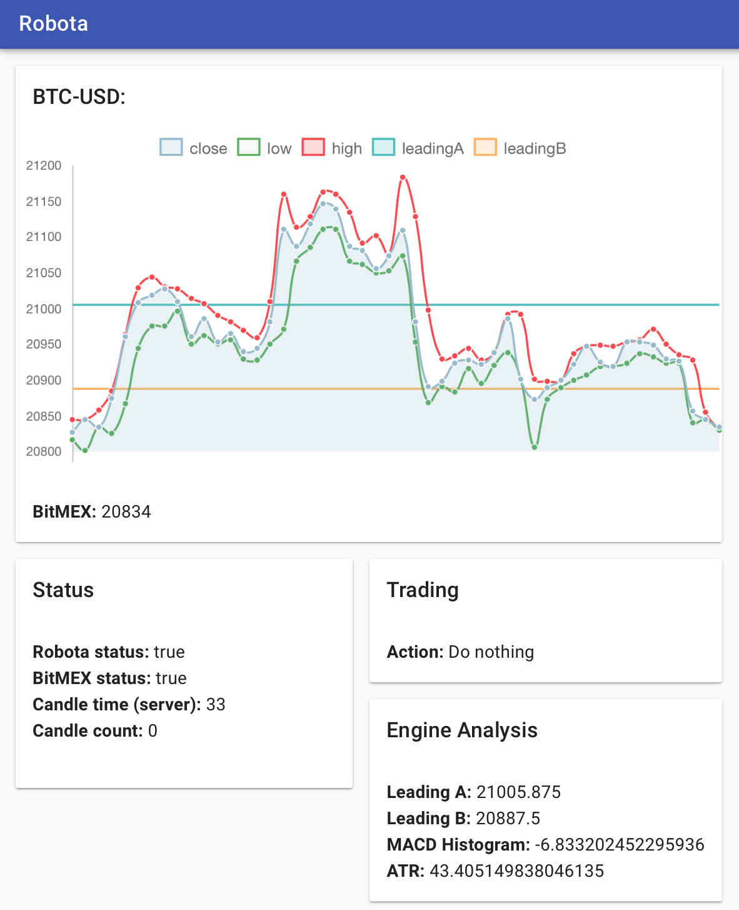

# Robota - A bitmex trading bot with a gui

### Demo: https://robota-bitmex-bot.herokuapp.com/console

A bitmex trading bot built on nodeJS with an AngularJS frontend. This server downloads the latest 750 candles, and then automatically syncs with the bitmex server to provide a true real-time feed with minimum latency. Ticker and candle duration can be changed.

Write your own trading logic in `robota/tradingengine.js`. 

I had this bot opening and closing positions automatically, but it seems that bitmex updated their API so I removed this functionality. I will probably rewrite the order execution at some point, but if you are so inclined, the place to start is in `robota/robotaAsync.js`, specifically `delegateResult` in the `trade()` function. 

Run with `node server.js`, dont forget to run `npm install`

Related projects: 

https://github.com/sashalex007/Backtesting-simulator

https://github.com/sashalex007/bitmex-historical-data-downloader
